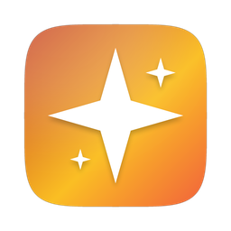
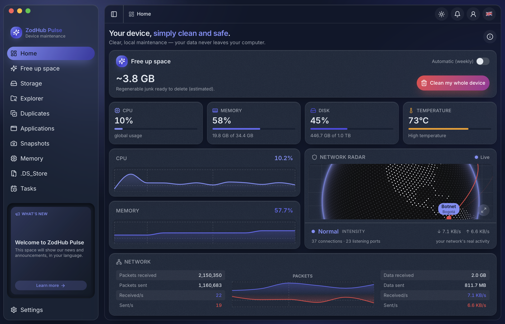
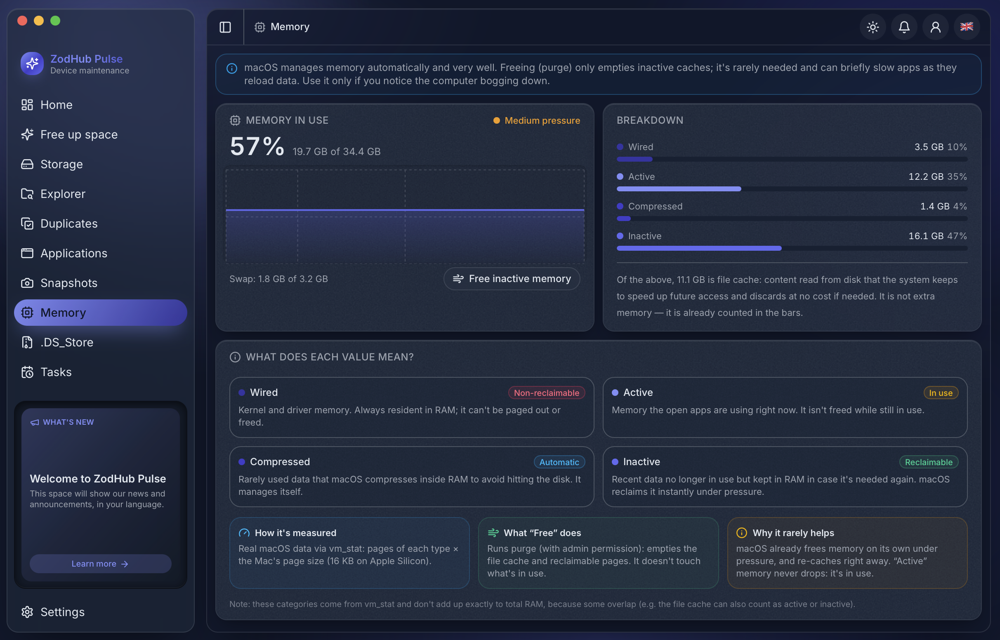
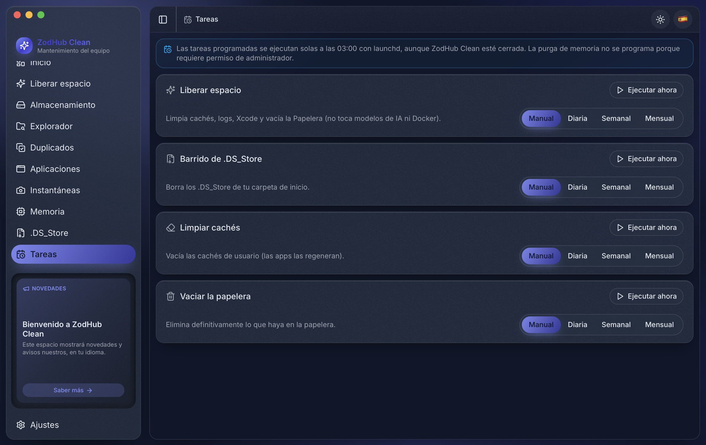
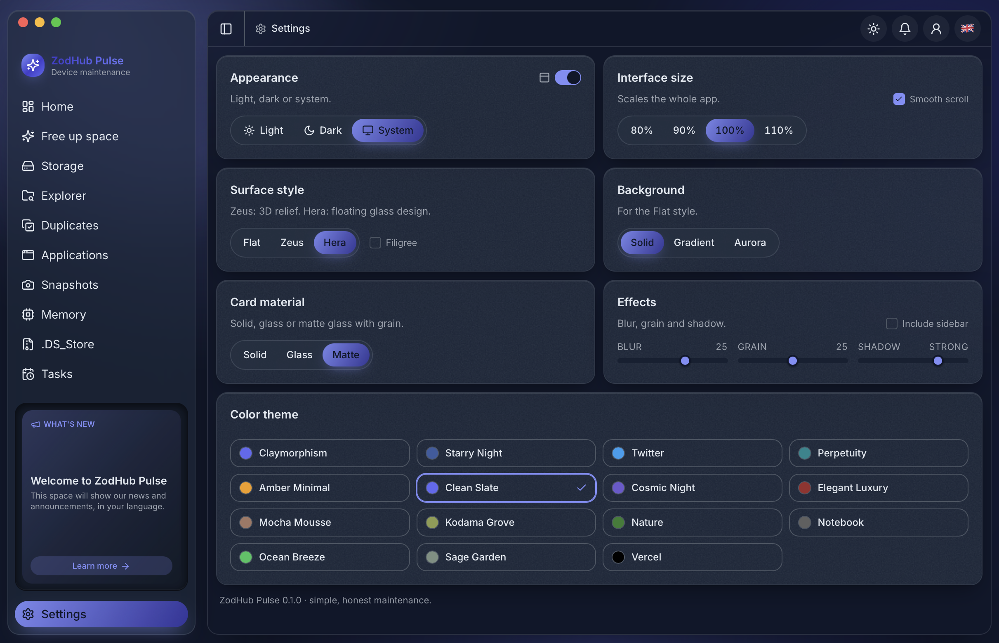
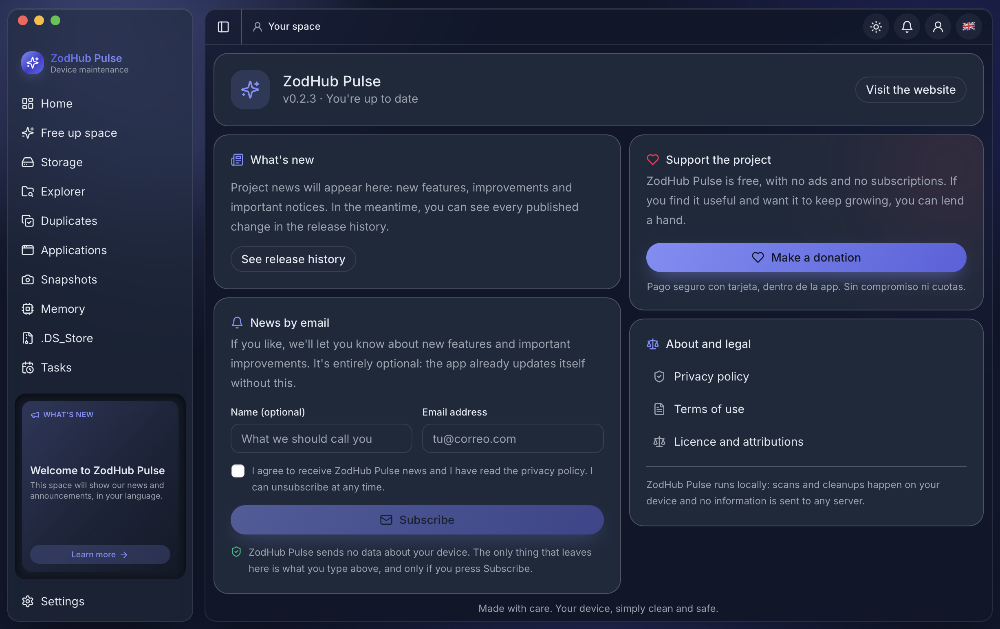

<div align="center">



# ZodHub Pulse

**Tu equipo, sencillamente limpio y seguro.**

Utilidad de mantenimiento y limpieza para **macOS y Windows**: directa, transparente y
100 % local. Hace lo esencial —limpiar cachés, liberar espacio, encontrar duplicados,
desinstalar de verdad, automatizar el mantenimiento— sin la monstruosidad ni el humo de
los limpiadores comerciales.

🇬🇧 [Read in English](README.md)

[](https://github.com/zodhub-app/pulse/releases/latest)
[-0078D4?style=for-the-badge&logo=windows&logoColor=white)](https://github.com/zodhub-app/pulse/releases/latest)


[](https://github.com/zodhub-app/pulse/releases/latest)

</div>

---

<div align="center">
  
  <br><em>Resumen: telemetría en vivo, radar de red y monitor de procesos.</em>
</div>

<table>
  <tr>
    <td width="50%"><br><sub><b>Memoria</b> — presión de RAM y desglose explicado.</sub></td>
    <td width="50%"><br><sub><b>Tareas</b> — mantenimiento programado con launchd.</sub></td>
  </tr>
  <tr>
    <td width="50%"><br><sub><b>Ajustes</b> — temas, apariencia y escala de la interfaz.</sub></td>
    <td width="50%"><br><sub><b>.DS_Store</b> — comprime en zip limpio y barre los .DS_Store.</sub></td>
  </tr>
</table>

<div align="center"><sub>Y además: Almacenamiento, Explorador de archivos grandes, Instantáneas APFS, Cachés de desarrollo, Desinstalador y Duplicados.</sub></div>

---

## Descargar

Todo está en **[la última versión](https://github.com/zodhub-app/pulse/releases/latest)**.

| Sistema | Archivo | Notas |
| --- | --- | --- |
| **macOS** 12 o superior | `..._universal.dmg` | Un único archivo para Intel y Apple Silicon |
| **Windows** 10 y 11 (64 bits) | `..._x64-setup.exe` | Recomendado |
| **Windows** (empresa) | `..._x64_en-US.msi` | Para despliegue por directiva de grupo |

### Primera instalación

**macOS** — abre el `.dmg`, arrastra la app a *Aplicaciones* y la primera vez ábrela con
**clic derecho › Abrir**. Solo esa vez.

**Windows** — ejecuta el instalador. Aparecerá *«Windows protegió tu PC»*: pulsa
**Más información › Ejecutar de todas formas**. También solo la primera vez.

Ese aviso sale en los dos sistemas porque todavía no firmamos con un certificado de pago,
no porque el programa haga nada raro. Puedes leer el código entero en este repositorio
antes de fiarte, que es la única garantía que vale de verdad. A partir de ahí, la app
**se actualiza sola** en ambos sistemas.

📖 **[Guía de instalación completa](docs/INSTALACION.md)** — paso a paso para Mac y Windows,
instalación silenciosa para administradores, cómo verificar la descarga, cómo desinstalar y
solución de problemas frecuentes.

## Qué hace

- **Resumen** — telemetría en vivo (CPU, memoria, disco, temperatura), radar de red y un
  monitor de procesos estilo Monitor de Actividad.
- **Almacenamiento** — desglose del disco por categorías, con histórico de crecimiento.
- **Explorador** — encuentra los archivos y carpetas más grandes y los revela en el Finder
  o en el Explorador, según el sistema.
- **Liberar espacio** — cachés del sistema, temporales, Docker, npm/pnpm/NuGet/Gradle,
  modelos de IA y Papelera, todo con su tamaño real medido.
- **Memoria** — presión de RAM y purga opcional, con la etiqueta honesta de que es una
  aproximación y de que el sistema ya gestiona bien la memoria.
- **Desinstalador** — quita programas y los archivos que dejan atrás. En Windows llama al
  desinstalador oficial del propio programa, no inventa uno.
- **Duplicados** — buscador por contenido (huella SHA-256), no por nombre de archivo.
- **Tareas** — mantenimiento programado (diario, semanal o mensual) con `launchd` en macOS
  y el Programador de tareas en Windows.
- **Instantáneas APFS** *(solo macOS)* — lista y adelgaza las copias locales de Time Machine.
- **.DS_Store** *(solo macOS)* — comprime en zip limpio y barre los `.DS_Store`.

Las secciones que no tienen sentido en un sistema **no aparecen** en él, en vez de mostrarse
vacías o fingir que hacen algo.

## Principios

- **Honestidad.** Nada de promesas absolutas ni «antivirus». Si un dato no existe (p. ej. un
  sensor de temperatura), se muestra `—`, nunca un valor inventado.
- **Privado y local.** Todo se ejecuta en tu equipo. Cero telemetría; tus datos nunca salen de él.
  Solo hay dos conexiones: comprobar si hay versión nueva y, si tú lo pides, el alta en el boletín.
- **Borrado responsable.** El borrado se previsualiza y se confirma; nunca se tocan rutas del sistema.

## Actualizaciones automáticas

ZodHub Pulse lleva un actualizador integrado. En la barra superior hay una **campana**: cuando
hay una versión nueva se enciende un **punto rojo con el número** de actualizaciones, y al pulsarla
puedes instalarla con un clic (descarga, **verifica la firma**, instala y reinicia). Nada de
reinstalar a mano.

Comprueba al arrancar y cada 6 horas, y puedes forzar la comprobación desde la propia campana.
Si no hay novedad dice «Estás al día»; si no puede comprobarlo (sin red), lo dice claramente en
vez de fingir que todo está al día.

Funciona igual en **macOS y en Windows**: cada versión publica un `latest.json` con las dos
plataformas, y los paquetes van firmados criptográficamente, así que el actualizador rechaza
cualquier cosa que no venga de nosotros.

## Para desarrolladores

Requisitos: Node 22+, Rust (rustup) y, según el sistema, las Command Line Tools de Xcode
(macOS) o las Build Tools de Visual Studio con el SDK de Windows.

```bash
npm run bootstrap      # npm install + componentes de shadcn
npm run tauri dev      # arrancar en desarrollo
```

Toda la lógica real (disco, red, sistema) vive en **Rust** (`src-tauri/src/*.rs`) como comandos
Tauri; el frontend (React 19 + Tailwind v4 + shadcn/ui) solo hace interfaz. Lo específico de
cada sistema se aísla con `#[cfg(target_os = ...)]` detrás de un contrato común, de modo que la
interfaz no sabe en qué sistema está salvo para ocultar lo que no aplica.

Para publicar una versión nueva, sube el número en `tauri.conf.json`, `Cargo.toml` y
`package.json`, y empuja un tag `vX.Y.Z`: el CI compila el `.dmg` universal y los instaladores
de Windows, los firma y crea una release en borrador con el `latest.json` de las dos plataformas.

## Stack

Tauri 2 · React 19 · Vite · TypeScript · Tailwind v4 · shadcn/ui · Rust (sysinfo, walkdir, trash, sha2, zip)

## Licencia

Software propietario de ZodHub. Puedes usarlo gratis y leer su código; no puedes
redistribuirlo ni crear obras derivadas. Ver [LICENSE](LICENSE),
[términos de uso](https://zodhub-app.github.io/pulse/terminos.html) y
[política de privacidad](https://zodhub-app.github.io/pulse/privacidad.html).

<div align="center"><sub>Hecho con cuidado por <a href="https://github.com/zodhub-app">ZodHub</a> · Tu equipo, sencillamente limpio y seguro.</sub></div>
